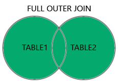

## En çok kullanılan sql komutları
1. SELECT
    1. Veri tabanından verileri çıkarır.
2. UPDATE
    1. Veritabanındaki verileri günceller.
3. DELETE
    1. Veritabanındaki verileri siler.
4. INSERT INTO 
    1. Veritabanına yeni veri ekler.
5. CREATE DATABASE
    1. Yeni veritabanı oluşturur.
6. ALTER DATABASE
    1. Veritabanını değiştirir.
7. CREATE TABLE
    1. Veritabanına yeni tablo ekler.
8. ALTER TABLE
    1. Veritabanındaki tabloyu değiştirir.
9. DROP TABLE
    1. Veritabanındaki tabloyu siler.
10. CREATE INDEX 
    1. Index oluşturur 
11. DROP INDEX
    1. Indexi siler

 
```sql 
--SELECT Veritabanındaki kayıtları getirmemizi sağlar.

select * from Customers --Customers tablosundaki tüm verileri getirir
select CustomerName, City from Customers --Customers tablosundaki CustomerName ve City sütunlarındaki verileri getirir
select distinct Country from Customers --select distinct aynı değerleri tek olarak bize getirir
select count (distinct Country) from Customers --Customers tablosunda kaç tane ülke olduğunu sayı olarak getirir
```
```sql
--WHERE sorgularımıza bir koşul oluşturur. Ayrıca Update, Delete gibi sorgularda da kullanılır.

select * from Customers Where City="London" --Customers tablosunda şehiri London olan kayıtları getirir.
select * from Employees Where EmployeeID>3 --Employees tablosunda EmployeeID'si 3'ten büyük olanları getirir. =, >, <, >=, <=, <>(!=) diğer kullanılan operatörlerdendir.
select * from Employees Where EmployeeID Between 2 and 5 --EmployeeID'si 2 ile 5 arasında olan verileri getirir.
select * from Employees Where City like 's%'--City ismi s ile başlayan verileri getir. (%d dersek eğer City isminin son harfi d olanları getirir.)
select * from Employees where LastName in ('Fuller','King') --Lastname'i Fuller ve King olanları getirir.

```
```sql
--ORDER BY istenilen verileri artan veya azalan şekilde sıralamamızı sağlar.
select * from Products order by UnitPrice --Default olarak Products tablosu UnitPrice'a göre küçükten büyüğe sıralandı.
select * from Products order by UnitPrice asc --asc yine küçükten büyüğe sıralar
select * from Products order by UnitPrice desc--desc ise büyükten küçüğe sıralar. Aynı zamanda verileri alfabetik olarakta sıralayabiliriz.
select * from customers order by Country, ContactName --ilk ülkeye göre sıralar ve aynı ülkelerden olan verileri ise ContactName'e göre sıralar.
select * from customers order by Country asc, ContactName desc --Ülkeyi alfabetik artan sıraya göre, contactName'i alfabetik azalan sıraya göre sıralar.
```
```sql
--AND operatörü birden fazla koşulu 've' anlamında bağlar
select * from customers where city="Berlin" and region="Western Europe" --city=berlin ve region=Western Europe olan verileri getirir.
select * from customers where Country="Germany" and city="Berlin" and region="Western Europe"--birden fazla AND operatörü kullanabiliriz.

--OR operatörü birden fazla koşulu 'veya' anlamında bağlar
select * from customers where city="Berlin" or region="Western Europe" --city=Berlin veya region=Western Europe olanları getirir.
select * from customers where Country="Germany" or city="Berlin" or region like 'W%' --birden fazla OR operatörü kullanabiliriz.

--AND - OR ÖRNEĞİ
--customers tablosunda ülkesi Almanya olan VE firma adı B VEYA D ile başlayan verileri getir
SELECT * from customers where Country="Germany" and (CompanyName like 'B%' or CompanyName like 'D%')
--NOT: like koşulunu parantez içerisine almasaydık ülkesi Almanya ve firma adı baş harfi B olan veya firma adı baş harfi D olan verileri getirir.
```
```sql
--NOT operatörü .... olmayan verileri getirir.
select * from customers where not Country="Germany" --customers tablosunda ülkesi Almanya olmayanları getirdi.
select * from customers where CompanyName not like 'C%' --CompanyName'i C harfi ile başlamayan verileri getirdi.
select * from Categories where CategoryID not between 2 and 4 --categoryID'si 2 ve 4 arasında olmayan verileri getirdi.
select * from customers where city not in ('Berlin', 'London') --şehiri Berlin ve London olmayan verileri getirir. Böylece birden fazla olmaması gereken şartları verebiliriz.
select * from Categories where not CategoryID>2--CategoryID'si 2'den büyük olmayan verileri getirir.
```
```sql
--INSERT INTO Tabloya yeni bir veri eklemek için kullanılır.
--tablo ismi ve kolon isimlerini vererek ekleyebiliriz.
INSERT INTO table_name (column1, column2, column3, ...)
VALUES (value1, value2, value3, ...)
--Tablolara iki şekilde ekleme yapılabilir.
--Tablo ismini verip kolon isimlerini vermeden ama tablodaki kolonlara uygun şekilde yazarak ekleyebiliriz
INSERT INTO table_name
VALUES (value1, value2, value3, ...)
--ÖRNEK
insert into Customers (CompanyName, ContactName, ContactTitle,City, Country) 
values ('ABC Şirketi','Mustafa Levent Aydemir','Software Developer','Kastamonu','Türkiye') --Customers tablosundaki bütün kolonlarada ekleme yapabiliriz ya da belirttiğimiz kolonlarada ekleme yapabiliriz.
insert into Customers (CompanyName, ContactName, ContactTitle,City, Country) 
values ('AAC Şirketi','Mustafa Levent Aydemir','Software Developer','Kastamonu','Türkiye'),
('ACC Şirketi','Muhammed Emre Nefesli','Software Developer','Yozgat','Türkiye'),
('ADC Şirketi','Gökhan Pirizoğlu','F-16 Makinist','Kastamonu','Türkiye')
--birden çok ekleme yapmak bu şekilde mümkündür.
```
```sql
-- IS NULL ve IS NOT NULL
select * from customers where Address is null--Customers tablosunda Adress sütunu null olan kayıtları getirir.
select * from customers where Address is not null--Customers tablosunda Adress sütunu null olmayan kayıtları getirir.
```
```sql
--UPDATE ..... SET tablo sütunları güncelleme
update customers set Address="Hocaimat Mahallesi"
where ContactName='Mustafa Levent Aydemir' --customers tablosunda contactName'i Mustafa Levent Aydemir olan kaydın Address'i Hocaimat Mahallesi olarak güncellendi
update customers set Address="Hocaimat Mahallesi", PostalCode='37300'
where ContactName='Mustafa Levent Aydemir' --Bu şekilde iki ayrı kolonu güncelleyebiliriz.
update customers set ContactName='Juan'
where Country='Mexico' --Ülkesi Meksika olan tüm kayıtların contactName'i Juan olarak güncellendi.
--!ÖNEMLİ!
--Where koşulunu yazmazsak tüm tabloda güncelleme yapar ve sıkıntı çıkar.
```
```sql
--DELETE tablodaki kayıtları silmek için kullanılır.
delete from customers where ContactName='Levent'--customers tablosunda ContactName'i Levent olan kaydı siler.
delete from Customers --Customers tablosu içerisindeki tüm kayıtları siler
drop table Customers --Customers tablosunu tamamen siler.
--!ÖNEMLİ!
--Foreign key ile bağlı olan kayıtlarda silme işlemi direkt yapılamaz. ON DELETE CASCADE kullanımıyla bu sorunu ileride çözeceğiz.
```
```sql
--SELECT TOP listelenecek kayıt sayısını belirlemek için kullanılır.
select * from customers limit 4 --customers tablosunun ilk 4 kaydını getirir.
select * from customers where CompanyName like 'B%' limit 3 --CompanyName baş harfi B olan ilk 3 kaydı getirir.
select * from customers order by ContactName desc limit 3--sıralama işlemi yapıp belirli sayıda kayıt getirilebilir.
--!ÖNEMLİ!
--Her veritabanı sistemi aynı kodu desteklemez.
--SQL Server/MS Access
SELECT TOP sayı|yüzde(percent) column_name(s)
FROM table_name
WHERE condition; 
--MySQL
SELECT column_name(s)
FROM table_name
WHERE condition
LIMIT number;
--Oracle 12
SELECT column_name(s)
FROM table_name
ORDER BY column_name(s)
FETCH FIRST number ROWS ONLY;
--Older Oracle
SELECT column_name(s)
FROM table_name
WHERE ROWNUM <= number;
```
```sql
--Aggregate İşlemleri
--MIN VE MAX minimum ve maksimum değerleri getirir
select min(UnitPrice)
from Products--fiyatı en düşük olan kaydı getirir.
select max(UnitPrice)
from Products--fiyatı en yüksek olan kaydı getirir.
--!ÖNEMLİ!
select max(UnitPrice) AS Fiyat
from Products--AS kullanarak UnitPrice sütununa Fiyat takma ismini verdik.
select min(UnitPrice) AS Fiyat, CategoryID
from Products
group by CategoryID--group by ile her kategorideki en düşük fiyat kayıtlarını getirdi.
--GROUP BY ilerleyen kısımlarda daha detaylı anlatılacak.

--COUNT belirtilen şartlarda varolan kayıt sayısını gösterir.
select count(*)
from Products--Products tablosundaki kayıt sayısını(satır sayıları) verir.
select count(ProductName)
from Products--(*) yerine sütun adı verirsek null olmayan kayıtları bize getirir.
select count(ProductID)
from Products
where UnitPrice>20--Fiyatı 20'den yüksek olan kayıtların sayısını verir.
select count(DISTINCT UnitPrice)
from Products
where UnitPrice>18--DISTINCT kullanarak fiyatı aynı olanları sadece bir kere saydı ve değerini bize verdi.
select count(*) AS [Kayıt Sayısı]
from Products--AS[**** *****] şeklinde sütun ismini değiştirip çıktıyı alabiliriz.
select count(*) AS [Kayıt Sayısı], CategoryID AS KategoriID
from Products
group by CategoryID --CategoryID'ye göre gruplandırıldığında CategoryID'ye göre kaçar tane kayıt varsa bize getirir.

--SUM belirtilen şartlardaki kayıtların toplamını bize verir.
select SUM(Quantity)
From OrderDetails --OrderDetails tablosundaki Quantity sütunu kayıtlarının toplamını verir.
select SUM(Quantity) AS Toplam
From OrderDetails
where ProductID=11 --belirtilen şarta göre kayıtların toplamını verir.
select OrderID, SUM(Quantity) AS [Toplam Miktar]
from OrderDetails
Group By OrderID --OrderID'ye göre gruplandırıp toplam miktarları verir.
SELECT SUM(Price * Quantity)
FROM OrderDetails
LEFT JOIN Products ON OrderDetails.ProductID = Products.ProductID--OrderDetails'i Products ile birleştirip toplam tutarı buluruz. 
--JOIN'leri ilerleyen kısımlarda detaylandıracağız.

--AVG Sayısal sütunların ortalamalarını hesaplar
select avg(UnitPrice)
from Products --Products Tablosundaki UnitPrice'ın ortalamasını verir.
select avg(UnitPrice) AS [Ortalama Birim Fiyatı]
from Products
where CategoryID=2 --CategoryID'si 2 olanların ortalamasını verir.
select * from Products
where UnitPrice > (select avg(UnitPrice) from Products) --Ortalama birim fiyatın üzerindeki kayıtları getirir. !Güzel bir örnek tekrar et.
select avg(UnitPrice) AS BirimFiyat, CategoryID
from Products
group by CategoryID --CategoryID'ye göre gruplandırılan kayıtların ortalama BirimFiyatlarını bize getirir.

--LIKE belirli kelime ya da harfe göre arama yapma işlemlerinde kullanılır.
select * from Customers
where ContactName like 'a%' --a harfi ile başlayan ContactName'leri getirir.
select * from Customers
where ContactName like '%a' --a harfi ile biten kayıtları getirir.
select * from Customers
where city like '%L%' --içerisinde L harfi bulunan kayıtları getirir.
select * from Customers
where ContactName like 'La%' --La ile başlayan müşteri kayıtlarını getirir.
select * from Customers
where city like 'L_nd__' --L ile başlayan ardından wildcard(joker karakter) olan ve nd ile devam edip iki tane joker karakter olan tüm kayıtları getirir.
select * from Customers
where ContactName like 'a%' or ContactName like 'b%'
order by ContactName --a veya b ile başlayan kayıtları getirip contactName'e göre alfabetik sıralar.
select * from Customers
where ContactName like 'e%n' --e ile başlayıp n ile biten kayıtları getirir.
select * from Customers
where ContactName like 'a__%' --a ile başlayan ve en az 3 karakter olan kayıtları getirir.
select * from Customers
where ContactName like '_u%' --ikinci harfi r olan kayıtları getirir.
select * from Customers
where Country like 'Spain' --herhangi bir joker karakter belirtilmemişse like içine yazılan ifadenin tablodaki ifadeyle birebir olması gerekir.
```
```sql
-- IN Operatörü birden fazla OR operatörünün kısaltmasıdır.
select * from Customers 
where Country IN('Germany','France','Brazil') --Ülkesi Almanya, Fransa veya Brezilya olan tüm kayıtları getir.
select * from Customers 
where Country NOT IN('Germany','France','Brazil')--Ülkesi Almanya, Fransa veya Brezilya olmayan tüm kayıtları getir.
select * from Customers 
where CustomerID IN (select CustomerID from Orders) --Orders tablosunda siparişi olan tüm müşteri kayıtlarını getirir.
select * from Customers 
where CustomerID NOT IN (select CustomerID from Orders) --Orders tablosunda siparişi olmayan tüm müşteri kayıtlarını getirir.
```
```sql
-- BETWEEN Operatörü belirli değerler arasındaki kayıtları getirmemizi sağlar
select * from Products
Where UnitPrice BETWEEN 10 AND 20 --Birim fiyatı 10-20 arasında olan kayıtları getirir.
select * from Products
Where UnitPrice NOT BETWEEN 10 AND 20 --Birim fiyatı 10-20 arasında olmayan kayıtları getirir.
select * from Products
Where UnitPrice BETWEEN 10 AND 20 and CategoryID IN (1,2,3) --Birim fiyatı 10-20 arasında olan ve CategoryID'si 1,2,3 olan kayıtları getirir.
select * from Products
where ProductName BETWEEN 'Carnarvon Rigers' AND 'Mozzarella di Giovanni'
ORDER BY ProductName --Belirtilen ProductName'ler arasındaki tüm kayıtları ProductName'in alfabetik sırasına göre getirir.
select * from Products
where ProductName NOT BETWEEN 'Carnarvon Rigers' AND 'Mozzarella di Giovanni'
ORDER BY ProductName --Belirtilen ProductName'ler arasında olmayan tüm kayıtları ProductName'in alfabetik sırasına göre getirir.
select * from Orders
Where OrderDate BETWEEN '2016-05-01' AND '2016-07-04' --Tarihler arasındaki sipariş kayıtlarını getirir.
```
```sql
--Aliases (AS) Takma Ad
select CustomerID AS ID
From Customers --CustomerID'ye ID takma adını verdik.
select CustomerID ID
From Customers --AS kullanmadan bu şekilde de takma ad verilebilir. Kullanılması tercih edilir.
select ProductName AS [En İyi Ürünler]
from Products --Boşluk içeren takma adlar vermek için çift tırnak içinde ya da köşeli parantez içinde kullanıyoruz.
SELECT ContactName, Address + ', ' + PostalCode + ' ' + City + ', ' + Country AS Address
FROM Customers --4 tane sütunu birleştirip tek bir takma ad verilebilir.
SELECT * FROM Customers AS Persons --Tablolarımızada takma ad verebiliriz.
SELECT o.OrderID, o.OrderDate, c.ContactName
FROM Customers AS c, Orders AS o
WHERE c.ContactName='Around the Horn' AND c.CustomerID=o.CustomerID --tablolara takma isim vererek yazmış olduğumuz kodları kısaltabilir ve anlaşılabilirliğini artırabiliriz.
```
```sql
--***JOIN*** iki veya daha fazla tablodaki satırları, aralarındaki ilgili sütuna göre birleştirir.
select o.OrderID, c.ContactName, o.OrderDate
from Orders AS o
INNER JOIN Customers AS c ON o.CustomerID=c.CustomerID --Orders tablosu ile Customers tablosunun aralarında bağlantı olan CustomerId'lerin birbirine eşit olanlarının kayıtlarını getirir.
SELECT o.OrderID, c.ContactName, s.CompanyName
FROM ((Orders AS o 
INNER JOIN Customers AS c ON o.CustomerID=c.CustomerID)
INNER JOIN Shippers AS s ON o.ShipVia=s.ShipperID) --3 tablonun birbiriyle bağlantılı olan ortak kayıtlarını getirir.
--**LEFT JOIN**
SELECT c.ContactName,o.OrderID
FROM Customers AS c 
LEFT JOIN Orders AS o ON c.CustomerID=o.CustomerID
ORDER BY c.ContactName -- Customers(sol) tablodaki tüm kayıtlar gelir ve Orders(sağ) tablosundaki CustomerID'leri eşleşen kayıtlar gelir.
--**RIGHT JOIN
SELECT o.OrderID, e.LastName, e.FirstName
FROM Orders AS o 
RIGHT JOIN Employees AS e ON o.EmployeeID=e.EmployeeID --Employees(sağ) tablosundaki tüm kayıtlar gelir ve Orders(sol) tablosundaki EmployeeID'leri eşleşen kayıtlar gelir.
SELECT c.ContactName, o.OrderID
FROM Customers AS c
FULL OUTER JOIN Orders AS o ON c.CustomerID=o.CustomerID
ORDER BY c.ContactName --Customers ve Orders tablosundaki tüm kayıtlar gelir. Kayıtlar eşleşsede eşleşmesede kayıtlar getirilir.
--**SELF JOIN Bir tabloyu kendisiyle birleştirme işlemlerinde kullanılır.
SELECT a.ContactName AS ContactName1, b.ContactName AS ContactName2, a.City, a.CustomerID, b.CustomerID
FROM Customers AS a, Customers AS b
WHERE a.CustomerID <> b.CustomerID
AND a.City=b.City
ORDER BY a.City --2 ayrı Customers tablosunda CustomerID'leri birbiriyle aynı olmayan ve City'leri birbiriyle aynı olan kayıtları City'lerine göre alfabetik sırayla getirir.
--!ÖNEMLİ
--Bazı veritabanlarında LEFT JOIN ya da RIGHT JOIN, LEFT OUTER JOIN ve RIGHT JOIN olarak adlandırılır.
--**RIGHT JOIN**


```

 
 
 
```sql
--**UNION Birden fazla Select ifadesinin sonucunu tek bir sütunda toplar ve getirir.
SELECT City FROM Customers
UNION
SELECT City FROM Suppliers
UNION
SELECT City FROM Employees
ORDER BY City --Customers, Suppliers ve Employees tablolarından City kayıtlarını aldı ve hepsini birleştirerek tek sütunda bize getirdi.
SELECT City FROM Customers
UNION ALL
SELECT City FROM Suppliers --UNION ALL dersek birleştirmeden kaçar tane varsa o şekilde bize geri getirir.
SELECT City FROM Customers
WHERE Country="Germany"
UNION
SELECT City FROM Suppliers
WHERE Country="Germany"
ORDER BY City --Sadece ülkesi Almanya olan değerler getirilir.
SELECT City FROM Customers
WHERE Country="Germany"
UNION ALL
SELECT City FROM Suppliers
WHERE Country="Germany"
ORDER BY City --Sadece ülkesi Almanya olan değerler getirilir ve UNION ALL olduğu için yinelenen kayıtlarda getirilir.
SELECT 'Customer' AS Type,ContactName, City, Country
FROM Customers
UNION
select 'Supplier',ContactName, City, Country
FROM Suppliers --Tüm Customers ve Suppliers'leri getirir. Gelen kayıtların nereden geldiğini anlamak için geçici bir tip oluşturduk. Ve buna takma ad verdik.
```
```sql
--**GROUP BY aynı değerlere ait olan kayıtları tek kayıt olarak almamıza sağlar.
SELECT count(CustomerID), Country
FROM Customers
GROUP BY Country
ORDER BY count(customerID) DESC --Customers tablosunda ülkeleri gruplandırarak CustomerID sayılarına göre getiriyor. ve en son yine CustomerID sayılarına göre büyükten küçüğe sıralıyor.
SELECT s.CompanyName, count(o.OrderID) AS NumberOfOrders FROM Orders AS o
LEFT JOIN Shippers AS s ON o.ShipVia=s.ShipperID
GROUP BY CompanyName --Orders(sol) tablosundaki tüm verileri ve Orders'ın içinde bulunan Shipper tablosundaki verileri CompanyName'e göre gruplandırıp OrderID değerlerini getirir.
```
```sql
--**HAVING where toplama işlemlerinde (count)kullanılamadığı için having'i kullanırız.
select COUNT(CustomerID), Country
from Customers
Group by Country
having COUNT(CustomerID)>3 --Customers tablosunu ülkelerine göre gruplandırır ve 3'ten fazla olan ülkelerin sayılarını bize getirir.
--!ÖNEMLİ 
--Aslında illa CustomerID'den sayılarını almamız gerekmez. Ülkelere bakıyor ve bize bu ülke adında kaç tane CustomerID varsa getiriyor. CompanyName'de olabilirdi.
select e.LastName, COUNT(o.OrderID) AS sayı
from (Orders AS o 
INNER JOIN Employees AS e ON o.EmployeeID=e.EmployeeID)
Group by LastName
having COUNT(o.OrderID)>10 --10'dan fazla sipariş kaydeden çalışanları listeler.
select e.LastName, COUNT(o.OrderID) AS sayı
from (Orders AS o 
INNER JOIN Employees AS e ON o.EmployeeID=e.EmployeeID)
where LastName='Dodsworth' OR LastName='Fuller'
Group by LastName
having COUNT(o.OrderID)>10 --10'dan fazla sipariş kaydeden Dodsworth veya Fuller soyisimli çalışlanları listeler.
```
```sql
--**EXISTS ve NOT EXISTS alt sorgularda istenilen şartların yerine getirilip getirilmediğine bakar ve bize değer döner.(T/F)
select ContactName
from Suppliers
where exists(select ProductName from Products where Products.ProductID=Suppliers.SupplierID AND UnitPrice>20) --Alt sorguda tedarikcileri aynı olan ve Birim fiyatı 20'den büyük olanları getirir.
select ContactName
from Suppliers
where not exists(select ProductName from Products where Products.ProductID=Suppliers.SupplierID AND UnitPrice>20) --Alt sorguda tedarikcileri Suppliers ve Products tablosunda bulunan ve birim fiyatları 20'den büyük olan kayıtları buldu. ama not exists dediğimiz için bu koşula uygun olmayanları bize getirdi.
```
```sql
--**ANY ve ALL 
-- Any alt sorgumuzdaki koşulumuz herhangi birini karşılıyorsa bize true döner. koşullardan birisi karşılanıp diğeri karşılanmasa bile bize değer döner.
-- All alt sorgumuzdaki tüm koşulların karşılandığı durumlarda bize değer döndürür.
select ProductName
from Products
where ProductID = ANY
(Select ProductID
from [Order Details]
where Quantity=100) --OrderDetails tablosunda Quantity'si 100'e eşit olan herhangi bir kaydın ProductID'si, Products tablosundaki ProductID'lere eşitse bize değeri döndürür.
select ProductName
from Products 
where ProductID = ALL (select ProductID from [Order Details] where Quantity=90) --OrderDetails tablosundaki quantity'lerin hepsi 90'a eşit mi? bir çok kayıt olup hepsi farklı olduğu için bize false döner. Aslında ALL metodunda eşitlik sorguları gereksiz olabilir.
```
```sql
--**SELECT INTO  var olan bir tablonun verilerini yeni bir tabloya taşımamızı sağlar.
select * into CustomersCopy
from Customers --CustomersCopy adında bir tablo oluşturdu ve Customers tablosundaki tüm verileri içerisine aktardı.
SELECT * INTO CustomersBackup2017 IN 'Backup.mdb'
FROM Customers --Başka bir veritabanındaki tabloyu yeni tablomuza kopyalamak için bu şekille kullanılır.
select ContactName, Address Into CustomersCopy2 
from Customers --yeni tabloya Customers tablosundan sadece ContactName ve Address bilgilerini kopyaladı.
select ContactName, Address into CustomersCopy3 
from Customers
where Country='Germany' --Ülkesi Almanya olan kayıtları yeni tabloya kopyalayadı.
select c.ContactName, c.Country, o.CustomerID,o.OrderDate
into jointablosu2
from Customers AS c 
LEFT JOIN Orders AS o ON c.CustomerID=o.CustomerID --joinleri kullanarak iki ayrı tablodanda kayıt kopyalayabiliriz.
select * into sema1
from Customers
where 1=0 --eğer bir tablonun şemasını kullanmak istiyorsak. şartı false dönen bir durum girip sadece şemayı kopyalayabiliriz.
```
```sql
--**INSERT INTO SELECT verileri bir tablodan kopyalayıp başka bir tabloya ekler. kopyalanacak kayıt sütunlarının birbirini karşılaması şarttır.
INSERT INTO Customers (CustomerName, City, Country)
SELECT SupplierName, City, Country FROM Suppliers --Suppliers tablosundaki istenilen kayıtlar Customers tablosuna kaydedildi. Doldurulmayan kayıtlar ise NULL dolduruldu.
INSERT INTO Customers (CustomerName, City, Country)
SELECT SupplierName, City, Country FROM Suppliers
WHERE Country='Germany' --Customers tablosuna Suppliers tablosundan ülkesi Almanya olanların bilgisi dolduruldu.
```
```sql
--**CASE if else yapısıyla aynıdır.
select OrderID, Quantity,
case
when Quantity=30 then 'quantity 30a eşit'
when Quantity>30 then 'quantity 30dan büyük'
else 'quantity 30dan küçük'
end as quantitytext
from [Order Details] --30'a eşitse şunu yap, 30'dan büyükse şunu yap, değilse 30'dan küçüktür..
--end as quantitytext=quantitytext adında sütun oluşturup içine bilgileri yazdırdı.
select ContactName, City, Country
from Customers
Order by
(case when City IS NULL then Country
else City end) --Şehir NULL ise ülkeye göre sırala, değilse şehire göre sırala.
```
```sql
--** ISNULL fonksiyonu kayıtlarda herhangi bir toplama vs işlemlerinde null değer varsa bize null döner. Null dönememsi için isnull fonksiyonunu kullanırız.
SELECT ProductName, UnitPrice * (UnitsInStock + UnitsOnOrder)
FROM Products -- Burada UnitsOnOrder sütununda null değer varsa bize null değer döndürür.
select ProductName, UnitPrice* (UnitsInStock+ISNULL(UnitsOnOrder,0))
from Products --ama ISNULL() kullandığımızda null ise 0 döndür anlamında bir durum söz konusu olur.
```
```sql
--** STORED PROCEDURE (saklı prosedür) 
--  sürekli kullandığımız sql sorguları varsa stored procedure ile bu sql sorgularını kayıt altına alıp tekrar tekrar yazmadan sql sorgusunu çağırarak elde edebiliriz.
create procedure GetProductsTable
AS
select * from Products
GO --Products tablome select sorgusu attım ve bunu procedure olarak oluşturdum.
exec GetProductsTable --komutunu yazdığım anda bana select sorgum otomatik olarak gelecek.
create procedure GetCustomersData @City nvarchar(30), @ContactName nvarchar(40)
AS
select * from Customers Where City=@City OR ContactName=@ContactName
GO --bir veya birden fazla parametreler vererek procedure oluşturabilirim. 
exec GetCustomersData @City='London', @ContactName='Liz Nixon' --Parametrelerin değerlerini vererek uygun kayıtları döndürebiliriz.
```

# SQL Database oluşturma işlemleri

```sql
--**CREATE DATABASE yeni bir database oluşturur.
CREATE DATABASE testDB --testDB adında database oluşturuldu.
DROP DATABASE testDB --testDB adında database kaldırıldı.
BACKUP DATABASE testDB
TO DISK = 'D:\backups\testDB.bak' --testDB'nin yedeğini belirttiğimiz dizine oluşturur.
--**ÖNEMLİ 
--FULL BACKUP oluşturulduktan sonra WITH DIFFERENTIAL ile sadece değişen,eklenen,silinen vs kayıtlar güncellenir. Zamandan tasarruf sağlar.
BACKUP DATABASE testDB
TO DISK = 'D:\backups\testDB.bak'
WITH DIFFERENTIAL --kullanımı bu şekildedir.
```
```sql
--**CREATE TABLE oluşturulan veritabanına yeni tablolar ekleriz.
CREATE TABLE Persons (
    PersonID int,
    LastName varchar(255),
    FirstName varchar(255),
    Address varchar(255),
    City varchar(255)
) --Persons adında tablo oluşturdum ve içerisine sütunlarını girdim. ilerleyen zamanlarda primarykey,foreign key öğreneceğiz.
CREATE TABLE TestTable AS
SELECT customername, contactname
FROM customers --customers tablosunu referans alarak bir tablo oluşturabiliriz.
```
```sql
--*DROP TABLE ve TRUNCATE TABLE
DROP TABLE Shippers
--drop table bir tabloyu silmek için kullanılır.
TRUNCATE TABLE Shippers
-- truncate table tablonun içindeki verileri silmek için kullanılır.
```
```sql
--*ALTER TABLE bir tabloya yeni sütun ekleme ya da silmek için kullanılır. Ayrıca kısıtlama ekleme ve kaldırma gibi işlerde yapılır.
ALTER TABLE Customers
ADD Email varchar(255)--Email sütunu eklendi

ALTER TABLE Customers
DROP COLUMN Email --Email sütununu sildi.

EXEC sp_rename 'Customers.Fax',  'FaxYeni', 'COLUMN' --Customers tablosundaki Fax sütunun adını FaxYeni olarak değiştirdi.

alter table Customers
alter column City nvarchar(30)--Customers tablosundaki City sütununun tipini değiştirdik.
--tipini dğeiştirebilir ya da tipi üzerinde değişiklik yapabiliriz.
```

# Constraints (Kısıtlamalar)
1. NOT NULL
2. UNIQUE
3. PRIMARY KEY
4. FOREIGN KEY
5. CHECK
6. DEFAULT
7. CREATE INDEX

```sql
--**NOT NULL sütunun NULL değer kabul etmemesi için kullanılır.
CREATE TABLE Persons (
    ID int NOT NULL,
    LastName varchar(255) NOT NULL,
    FirstName varchar(255) NOT NULL,
    Age int
) --bu şekilde kullanılır

ALTER TABLE Persons
ALTER COLUMN Age int NOT NULL --bu şekilde güncelleme yapılabilir.


--**UNIQUE tekrarlanan verilerin olmaması için kullanılır.
CREATE TABLE Persons (
    ID int NOT NULL UNIQUE,
    LastName varchar(255) NOT NULL,
    FirstName varchar(255),
    Age int
)


--**PRIMARY KEY benzersiz değerler içermelidir ve null olamaz. tabloda sadece bir tane primary key olabilir. 
CREATE TABLE Persons (
    ID int NOT NULL PRIMARY KEY,
    LastName varchar(255) NOT NULL,
    FirstName varchar(255),
    Age int
)
--ya da
CREATE TABLE Persons (
    ID int NOT NULL,
    LastName varchar(255) NOT NULL,
    FirstName varchar(255),
    Age int,
    CONSTRAINT PK_Person PRIMARY KEY (ID,LastName)
) --PK_Person isimlendirmesi yaptık. bir tane primary key var ama iki ayrı sütuna bağlayabildik.
ALTER TABLE Persons
ADD PRIMARY KEY (ID) --oluşturulmuş bir tablo üzerinden bu şekilde primary key ekleyebilir
ALTER TABLE Persons
DROP PRIMARY KEY -- bu şekilde kaldırırız.

ALTER TABLE Persons
ADD CONSTRAINT PK_Person PRIMARY KEY (ID,LastName)--birden fazla sütun için bu şekilde ekler
ALTER TABLE Persons
DROP CONSTRAINT PK_Person -- bu şekilde kaldırırız.


--**FOREIGN KEY birbiriyle bağlantılı olan tablolar arasında sütunları birbirine bağlar. bu işlem oluşacak listeleme problemlerinin önüne geçer.
CREATE TABLE Orders (
    OrderID int NOT NULL PRIMARY KEY,
    OrderNumber int NOT NULL,
    PersonID int FOREIGN KEY REFERENCES Persons(PersonID)
) --Orders tablosunun PersonID sütununu Persons tablosnun PersonID sütunundan referans alarak birbirine bağla.
CONSTRAINT FK_PersonOrder FOREIGN KEY (PersonID)
REFERENCES Persons(PersonID) --** bu şekilde isimlendiredebiliriz.

--sonradan eklemek istersek;
ALTER TABLE Orders
ADD FOREIGN KEY (PersonID) REFERENCES Persons(PersonID)
--ya da
ALTER TABLE Orders
ADD CONSTRAINT FK_PersonOrder
FOREIGN KEY (PersonID) REFERENCES Persons(PersonID)

--kaldırmak istersek
ALTER TABLE Orders
DROP CONSTRAINT FK_PersonOrder --şeklinde kullanırız.

--**NOT foreign key'i isimlendirmek ilerleyen aşamalarda silebilmemiz için daha mantıklı bir yol olur.


--**CHECK eklenecek değerin aralığını sınırlamak için kullanılır.
CREATE TABLE Persons (
    ID int NOT NULL,
    LastName varchar(255) NOT NULL,
    FirstName varchar(255),
    Age int CHECK (Age>=18),
    City varchar(255)
) --Age sütununa 18'e eşit ya da büyük olan değerler girilebilir.
CONSTRAINT CHK_Person CHECK (Age>=18 AND City='Sandnes') --isimlendirebiliriz. birden fazla şart koşabiliriz.

ALTER TABLE Persons
ADD CHECK (Age>=18) --sonradan ekleme yapabiliriz

ALTER TABLE Persons
ADD CONSTRAINT CHK_PersonAge CHECK (Age>=18 AND City='Sandnes')

ALTER TABLE Persons
DROP CONSTRAINT CHK_PersonAge --eklenen kısıtlamayı bu şekilde kaldırabiliriz.


--**DEFAULT sütuna herhangi bir değer girilmediği zaman default olarak gelen değeri belirtebiliriz.
CREATE TABLE Persons (
    ID int NOT NULL,
    LastName varchar(255) NOT NULL,
    FirstName varchar(255),
    Age int,
    City varchar(255) DEFAULT 'Sandnes'
) --City sütunu doldurulmazsa default olarak Sandnes gelecek.
CREATE TABLE Orders (
    ID int NOT NULL,
    OrderNumber int NOT NULL,
    OrderDate date DEFAULT GETDATE()
) --OrderDate doldurulmazsa default olarak sistem üzerinden tarih gelecek.
ALTER TABLE Persons
ADD CONSTRAINT df_City
DEFAULT 'Sandnes' FOR City --sonradan eklemek istersek eğer bu şekilde ekleyebiliriz.
ALTER TABLE Persons
ALTER COLUMN City DROP DEFAULT --sonradan kaldırmak için iste bu şekilde kaldırma işlemi yaparız.


--**CREATE INDEX veritabanındaki kayıtları diğerlerinden daha hızlı alabilmek için kullanılır.
--kullanıcılar tarafından bu indexler görünmez.
--fakat güncelleme yaparken indexler güncellemeyi yavaşlatacağı için mümkün olduğunca çok kullanılan sütunlar için index oluşturulur.
CREATE INDEX idx_pname
ON Persons (LastName, FirstName) --idx_pname adında bir index oluşturduk.

DROP INDEX table_name.index_name --bu şekilde oluşturulan indexi kaldırdık.


--** AUTO INCREMENT yeni bir kayıt eklendiğinde artış sağlayarak benzersiz bir kayıt elde ederiz.
--genellikle primary key olan sütunumuz auto-increment olur
CREATE TABLE Persons (
    Personid int IDENTITY(1,1) PRIMARY KEY,
    LastName varchar(255) NOT NULL,
    FirstName varchar(255),
    Age int
) -- IDENTITY ile kullanılır ve 1'den başla 1'er 1'er art demiş olduk. (10,5) deseydik 10'dan başlar ve 5'er 5'er artardı.
INSERT INTO Persons (FirstName,LastName)
VALUES ('Lars','Monsen') --tabloya bir kaydı bu şekilde eklesek bile PersonID'ye otomatik olarak değer gelecektir. 


--** Dates tarih eklemelerinde eklemek istediğimiz tarih formatının veritabanı formatına uygun olması gerekmektedir.
DATE - format YYYY-MM-DD
DATETIME - format: YYYY-MM-DD HH:MI:SS
SMALLDATETIME - format: YYYY-MM-DD HH:MI:SS
TIMESTAMP - format: a unique number


--**CREATE VIEW bir veya birden fazla tablodan istenilen verileri sanki tek bir tabloymuş gibi görüntülememizi sağlar.
CREATE VIEW [Brazil Customers] AS
SELECT CustomerName, ContactName
FROM Customers
WHERE Country = 'Brazil' --şeklinde yazılır

SELECT * FROM [Brazil Customers] -- ülkesi Brazil olanların CustomerName ve ContactName'lerini getirir.
CREATE VIEW [Products Above Average Price] AS
SELECT ProductName, Price
FROM Products
WHERE Price > (SELECT AVG(Price) FROM Products) --şartta belirtebiliriz.

CREATE OR REPLACE VIEW [Brazil Customers] AS
SELECT CustomerName, ContactName, City
FROM Customers
WHERE Country = 'Brazil' --view sorgumuzu güncellemek için CREATE OR REPLACE VIEW kullanılır.
DROP VIEW [Brazil Customers] -- bu şekilde oluşturduğumuz view silinir.
```

# STRING VERİ TİPLERİ
1. CHAR(n)
    - 0-255 arasında karakterler alır.
    - Genellikle çok değişmeyen ülke kodları, posta numaraları gibi durumlarda kullanılır.
2. VARCHAR(n)
    - varchar(15) yazıp 3 harfli bir kelime girersek, varchar(3) şeklinde yer edinecek.
    - Bu durum daha az yer kaplayacağı için performansı artırır.
    - maksimum 1.073.741.824 karakter alabilir.
3. text
    - metin verileri için kullanılır.
    - 2gb'a kadar veri depolayabilir.
4. nchar
    - char'ın yarısı kadar veri depolayabilir.
5. nvarchar
    - varchar'ın yarısı kadar veri depolayabilir.
    - maksimum 536.870.912 karakter alabilir.
6. ntext
    - unicode'lar depolayabiliriz.
    -2gb'a kadar unicode depolanabilir.
7. binary(n)
    - 8000 byte kadar veri depolar.
    - n değeri kadar yer kaplar
8. varbinary
    - 8000 byte kadar veri depolar.
    -girilen değer kadar yer kaplar.
9. varbinary(max)
    - 2gb kadar binary veri depolayabilir.
10. image
    - Resim dosyalarını saklamak için kullanılır.
    - İşlevsellik olarak varbinary(max) ile aynıdır.
    - İlerleyen zamanda bu veri türünün kaldırılma ihtimali olduğu için varbinary(max) kullanılması önerilir.


# NUMERIK VERİ TİPLERİ
1. bit
    - 0, 1 veya null değerler depolanır
    - True False işlemleri için uygundur.
2. tinyint
    - 0-255 arası tam sayıları depolar.
    - Genellikle yaş verileri gibi durumlarda kullanırız.
3. smallint
    - -32.768 - 32.767 arası tam sayıları depolar.
4. int 
    - -2,147,483,648 - 2,147,483,647 arası tam sayıları depolar.
    - En çok kullanılan veri tipidir.
5. bigint
    - -9,223,372,036,854,775,808 - 9,223,372,036,854,775,807 arası tam sayıları depolar.
6. decimal(p,s)
    - Ondalıklı sayılarda kullanılır.
    - p toplam basamak sayısını,
    - s ise virgülsen sonraki ondalık kısmı gösterir.
7. numeric(p,s)
    - decimal ile aynıdır.
8. smallmoney
    - -214,748.3648 - 214,748.3647 arasında ondalık sayı depolar. 
    - Ondalık kısmı 4 basamağa kadardır.
9. money
    -  -922,337,203,685,477.5808 - 922,337,203,685,477.5807 arası ondalık sayıları depolar.
    - Ondalık kısmı 4 basamağa kadardır.
10. float(n)
    - 1-53 arası onladıklı sayı depolar.
    - n belirtilmezse default olarak 53 olur.
11. real
    - 3.40E+38 ile 3.40E+38 arasında değer alır
    - ???


# Tarih ve Saat Veri Tipleri
1. datetime
    - YYYY-MM-DD hh:mm:ss:mmm şeklinde varsayılan formatı vardır.
2. datetime2
    - YYYY-MM-DD hh:mm:ss:mmmmmmm şeklinde varsayılan formatı vardırç
    - datetime ile farklı salisesi 7 basamağa kadar çıkabilir.
3. smalldatetime
    - YYYY-MM-DD hh:mm:ss şeklinde varsayılan formatı vardır.
4. date
    - En yaygın tarih depolama tipidir.
    - YYYY-MM-DD şeklinde varsayılan formatı vardır.
5. time
    - Sadece saat verilerini depolar.
    - hh:mm:ss:nnnnnnn şeklinde varsayılan formatı vardır.
6. datetimeoffset
    - Kullanım şekli ve veri aralığı olarak datetime2 ile aynıdır.
    - 11.09.2023 20:30:15.1234567 +03:00 şeklinde varsayılan formatı vardır. 
7. timestamp
    - Bir kayıt oluşturulduğunda ya da değiştirildiğinde güncellenen bir veri saklar.
    - Gerçek zamana karşılık gelmez.


# Diğer Veri Tipleri
1. sql_variant
    - sayısal, text bazlı, binary gibi veri tiplerini depolayabilir.
    - Maksimum uzunluğu 8000 byte
2. uniqueidentifier
    -  Guid (Globally unique Identifier) tipinde veri tutar.
    - Her üretildiğinde benzersiz oluşur
3. xml
    - xml türündeki verileri depolamak için kullanılır.
    -Kapasitesi 2gb.
    - xml verisinin boyutuna göre kapladığı yer değişkenlik gösterir.
4. cursor
    - Belirli bir veri kümesi üzerinde satır satır işlem yapmamızı sağlar.
5. table
    - Daha sonra işlenmesi için içerisinde bir sonuç verisi saklar.

